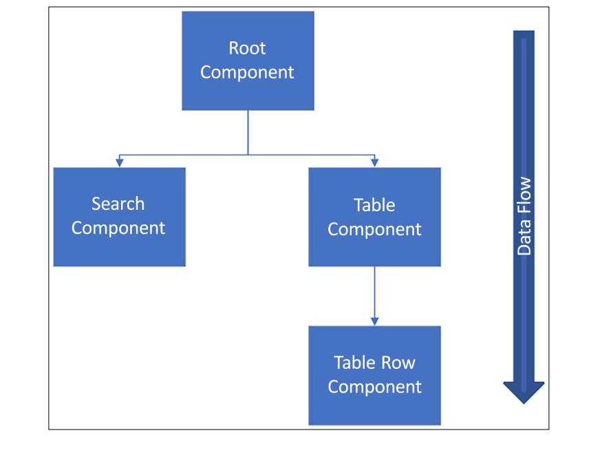

# 과제 
1. korit_12_react 폴더를 적절한 위치에 생성
2. learning_logs 폴더를 생성.
3. 20260303.md 파일을 생성하고 과제를 타이핑
4. github에 korit_12_react repository를 생성
5. push 완료

# VS code react extension 설정
1. ESlint
  - JavaScript용 오픈 소스 린터로, 소스 코드에서 문제를 찾아 수정하는 것을 도와줌.
    (빨간줄 잘 띄어준다는 의미.)
2. Reactjs code snippets
  - 단축어 지원.

# React 앱 만들기 및 실행
저희는 vite project를 사용할 것임. Next.js나 Remix와 같은 다른 리액트 프레임워크가 존재하나,
기초 학습용으로는 얘가 좀 나음. 예전에는 CRA(Create React App)을 가장 많이 이용했으나
현재 이용율도 감소하고, React19에서는 공식적으로 지원 중단됨.

## react 앱 만들기 process
1. vs code 상에서 ctrl + shift + `(백틱) 으로 터미널 열기
2. npm 명령어를 사용 할것 (4.4 버전으로)
`npm create vite@4.4`
  - 이상의 명령어를 엔터 칠 경우 안되면 node.js가 없기에...
  - `node -v` / `npm -v`
3. 크롬에서 node.js 검색. - LTS 버전
  - 설치 후 vs code 재실행
  - 그래도 안되면 git bash로 터미널 열어
  - node -v / npm -v 확인
4. `npm create vite@4.4`
  - y 눌러서 ok to process
  - 수업 기준으로 framework 선택하는 부분에서 -> React
  - variant 선택 부분에서 -> JavaScript(추후 TypeScript 적용 예정)
  - 그러면 막 설치한 다음에 리눅스 명령어가 몇개 나옴.
    - cd 프로젝트명으로 나오는데, learning_logs와 분리하기 위해 별개의 vs code 창으로 띄움
    - npm install : 매우 중요
      - SpringBoot 상에서 build.gradle에 있는 의존성들 목록이 있는 것 처럼
        react 프로젝트에는 package.json이라고 하는 곳에 의존성 목록들이 존재.
        그것들을 설치해야 프로젝트가 실행 간으

      - `npm run dev` : 실행시키기 위한 명령어 (커스텀 가능)

      - 이상의 수업에서 많이 실수 목록
        1. 오랜만에 스프링부트 했을 때 왜 실행 안될까와 동일함.
           프로젝트명이 가장 상위로 잡혀야 함.
           korit_12_react에서 npm install / npm run dev 하면 안됨.  

## React 앱 debugging 하기
1. chrome -> react developer tools를 검색 -> 설치 후에 chrome 재실행
2. react project 상에서 f12를 통해 개발자 모드를 진입하면 js 배울 때
   console 있는 부분 맨 끝에 무슨 보라색인지 파란색인지 리액트 아이콘 있는 components라는 애가 새로 생김.
   이는 리액트 컴포넌트 트리가 시각적으로 표현되며, 검색창을 이용해서 특정 컴포넌트를 검색하는 것이 가능함.
3. Console 파트에서 JS 코드의 메시지, 경고, 오류를 확인할 수 있음.
4. Network 파트에서 SpringBoot에서 봤던 401 / 404 / 500 등의 요청 및 응답을 확인 가능.

# Starting React

## React Component를 만드는 법
리액트는 UI를 위한 JS 라이브러리에 해당
(프레임워크 / 라이브러리의 의미는 다양함).
15 버전 이후부터는 MIT 라이선스에 따라 개발되는 중임.
리액트는 독립적이고 재사용이 가능한 컴포넌트를 기반으로
작동하는 프레임워크라고 정의할 수 있음.




이상의 구조를 바탕으로 설명

현재 이미지에서 root 컴포넌트에는 검색 컴포넌트와 표 컴포넌트라는 두 개의 하위 컴포넌트가 존재함.
그리고 표 컴포넌트에는 표 - 행 컴포넌트라는 하위 컴포넌트 하나가 존재함.
리액트에서 이해해야 할 중요한 점은 **데이터의 흐림이 상위 컴포넌트에서 하위 컴포넌트로 일방향 이동한다는 점**임.
Props를 통해 상위 컴포넌트에서 하위 컴포넌트로 데이터를 전달하는 방법 수업 예정.

- React는 UI를 선택적으로 다시 렌더링하기 위해서 VDOM (Virtual Document Object Model)을 이용함.
  DOM은 웹 페이지의 구조화된 객체 트리 구조를 표현하는 웹 문서용 프로그래밍 인터페이스를 의미하고,
  각 트리의 객체는 문서의 일부에 해당함. 그래서 .html 파일들을 보면 들여쓰기가 왕창 되어 있음.
  그리고 개발자들은 DOM을 이용하여 문서를 만들고, 구조를 탐색하고, element와 컨텐츠를 추가, 수정, 삭제하는 것이 가능.
  그런데 VDOM은 경령화된 DOM에 해당하는데, 매번 전체 정보를 다 불러오는 DOM과 달리 VDOM의 경우 값이 바뀐 부분만 들고 온다는 차이.
  VDOM이 업데이트된 후 리액트는 업데이트가 실행되기 전의 VDOM의 스냅샷과 비교한 후, 변경된 부분만 실제 DOM에 업데이트하는 과정을 거치게 됨.

- React 컴포넌트는 함수 컴포넌트인 JS 함수 또는 클래스 컴포넌트인 ES6 JS 클래스를 통해 정의

- 이하는 Hello World 텍스트를 렌더링하는 코드의 예시
```jsx
function App() {
  return <h1>Hello World !</h1>
}
```

- React 컴포넌트는 return이 필수임.

- 그리고 우리는 안쓰겠지만 ES6의 클래스를 이용하여 컴포넌트를 생성하는 방법도 있음.

```jsx
class App extends React.Componet {
  render() {
    return <h1>Hello World !</h1>
  }
}
```

첫 번째 코드블록을 함수 컴포넌트 / 두 번째 클래스를 컴포넌트라는 표현을 씀
수업 상황에서는 함수 컴포넌트를 기본적으로 사용할 것.
이걸 굳이 수업하는 이유는 React 16.8 이전에는 함수 컴포넌트 작성이 불가능했고,
클래스 컴포넌트만 사용 가능했기에...

- 참고 사항 #1 : 일반적인 JS 함수와의 차이를 두기 위해 React 컴포넌트는 파스칼 케이스로 명명하는 것이 좋음.

- 참고 사항 #2 : 이하와 같이 작성하면 오류가 남.
```jsx
export default function App() {
  return (
    <h1>Hello World !</h1>
    <h2>This is my First Component !</h2> 
  )
} 
```
C:\lgy\korit_12_react\myapp\src\App.
jsx: Adjacent JSX elements must be wrapped in an enclosing tag. 
Did you want a JSX fragment <>...</>? (4:4)

- 만약에 컴포넌트가 다수의 html 태그 요소를 return 한다면
  하나의 상위 요소 안에 넣어줘야 함.
  옛날에는 

```jsx
export default function App() {
  return (
    <div>
      <h1>Hello World !</h1>
      <h2>This is my First Component !</h2> 
    </div>
  )
}
```

## JS 리뷰
### 상수 vs 변수
1. 상수 : const 선언자를 통해 사용. 값 재할당 불가능.
2. 변수 : let 선언자를 통해 사용. 값 재할당 가능.

- const는 블록 범위로 제한됨.
  즉, const는 해당 변수가 정의된 블록 내에서만 이용이 가능함.
  (즉, 전역이 아니라 지역 변수의 일종으로 볼 수 있음.)

```jsx
let count = 10;
if (count > 5) {
  const total = count * 2;
  console.log(total);     // 20 출력
}
console.log(total);       // 오류
```

- cosnt가 객체 또는 배열일 때 어떻게 되는지에 대한 예시

```jsx
const myObj = {id : 3};     // 이건 자료형 JS, 객체임.
myObj.id = 4;               // 이건 가능함.
```

- 이상의 경우에서 const는 상수인데 어떻게 id값을 변경할 수 있는지에 대한
  의문이 생길 수 있음.
  myObj은 const이지만 myObj.id가 const이지는 않음.

### Template Literal
저희는 이미 다 학습했지만, 일반적으로 문자열을 연결하는 예시부터 수업
```jsx
let person = {
  firstName : "Jone",
  lastName : "Doe"
}

let greeting = 'Hello' + person.fistName + ' ' + person.lastName;
```

템플릿 리터럴은 기억이 안날 수도 있지만 python에서의 f-string을 기억해주면 좋음.

탬플릿 리터럴 적용 예시
```jsx
let person = {
  firstName : "Jone",
  lastName : "Doe"
}

let greeting `Hello ${person.fistName} ${person.lastName}`;
```

## 객체 구조 분해
- 객체 구조 분해를 이용하면 객체에서 값을 추출하여 변수에 할당 할 수 있음.
  단일 구문을 이용하여 객체의 여러 속성을 개별 변수에 할당하는 것도 가능.
  예시를 들겠음.(React에서 많이 사용됨.)

```jsx
let person = {
  firstName : "Jone",
  lastName : "Doe",
  email : "j.doe@test.com"
}
```
그러면 만약에 Jone이라고 하는 stirng 데이터를 가지고 오고 싶다면 기본적으로
```jsx
let firstName = person.firstName;
```

그런데 이게 properties가 늘어나면 늘어날 수록 엄청 귀찮은 것 같음.

그래서 객체 구조 분해가 등장하게 되었는데,

```jsx
const {firstName, lastName, email} = person;
```

이상의 의미는 _처음으로_ firstName, lastName, email이라고 하는
세 개의 변수를 선언하고, 그 값을 person 객체의 동일한 key를 지니고 있는 데서
value를 빼와 대입한다는 의미가 됨.
이게 의미가 이해되지 않으신다면

```jsx
const firstName = person.firstName;
const lastName = person.lastName;
const email = person.email;
```
을 한 줄로 줄인거라고 이해하셔도 됨.

### 클래스 / 상속
- ES6의 클래스 정의는 Java와 C#같은 다른 객체 지향 언어들과 유사함.

```jsx
class Person {
  constructor (firstName, lastName) {
    this.firstName = firstName;
    this.lastName = lastName;
  }
}
```

이상의 코드에서는 클래스 정의 방법과 AllArgsConstructor를 정의하는 방법을 작성함.
그리고 method도 있을 수도 있지만 여기서는 생략함.

```jsx
class Employee extends Person {
  constructor (firstName, lastName, title, salary) {
    super (firstName, lastName);
    this.title = title;
    this.salary = salary;
  }
}
```
그러면 자바 / 파이썬과 유사한 점과 차이점을 알 수 있음.
super()의 경우에는 자바와 완전히 일치하는 것을 확인 가능.
생성자의 매개변수 내에 자료형이나 선언자가 없다는 점은 파이썬과 일치.

### Arrow Function
- 일반적인 함수를 정의하는 방법은 function 키워드를 사용하는 것.
  근데 Component 작성 시에도 사용해서 이 방식도 알아두셔야 함.

```jsx
function(x) {return x * 2;}
```
근데 이걸 화살표 함수로 작성하면
```jsx
x => x * 2;
```
이렇게 씀. 여기에 딸려있는 여러 원칙들을 복습하겠음.

이상은 화살표 함수를 사용하여 동일한 함수의 선언을 더 간결하게 만들었음.
이는 익명 함수의 일종으로, 이 함수 자체를 호출할 수가 없음.
허나 이 익명 함수의 사용처는 주로 다른 함수의 argument로 가능함.
그리고 let 선언자 이후에 변수명에 저장 가능하다는 점과 합치게 되면
원래는 호출이 불가능했던 익명 함수의 호출이 가능해짐.

```jsx
const calc = x => x * 2;
```

이상의 경우가 arrow function을 calc라고 하는 상수명에 대입한 예시가 됨.
이 경우 함수를 이하와 같은 방식으로 호출하는 것이 가능해짐.

```jsx
calc(5)       // 10이 return
```
1. 매개변수가 둘 이상인 경우에는 소괄호를 사용해야 함.

```jsx
const calcSum = (x, y) => x + y;

// 함수 호출
calcSum(2, 3);        // 5 return
```
2. 함수 본문이 표현식인 경우 return을 명시할 필요가 없음.
   허나 함수 구현부이 여러 줄 해당하는 경우에는 {}와 return이 
   명시되어야 함.
```jsx
const calcSum = (x, y) => {
  console.log('결과를 계산중...');
  return x + y;
}
```
    - 근데 한 줄인데 {} 쓰면 무조건 return이 있어야 함.
    - {} 안쓰고 두 줄 쓰면 오류남.
    - 이상의 두 가지 사항을 다 합쳤을 때, 한 줄인데 {} 없고,
      retrun을 요구하는 표현식인 경우에는 return 안써도 됨.
      하나라도 빠질 경우 {}와 return이 요구됨.
      (근데 애초에 call1(), call2(), call3() 유형이면 어캄?
      -> 그럼 return 없음.)

3. 매개변수가 없다면 비어있는 ()가 요구됨.
```jsx
const sayHello = () => 'Hello!';

console.log(`${sayHello} Jone !`);
```

### Jsx와 스타일링
- JSX는 JavaScript XML의 축약어임. 근데 XML은 Extended Markup Langaue 였음.
  이 개념에서 제일 자주 쓰이는 중요한 것은 {}를 사용하여 JS 표현식을 JSX에 표현 가능하다는 점.

이하의 예시는 JSX로 컴포넌트의 프롬에 접근하는 방법
```jsx
function App(props) {
  return <h1>Hello World {props.user}</h1>
}
```
근데 여기에 JS 표현식도 전달이 가능.

```jsx
<Hello count = {2 + 2} />
```

Jsx 요소에는 inline 스타일링과 외부 스타일링 방식이 다 가능.

```jsx
<div style = {{height : 20, width : 200}}>
  Hello
</div>
```

```jsx
const divStyle = {
  color : 'red',
  height: 30
  };
const MyComponent = () => {
  <div style = {divStyle}>
    Hello Again
  <div>
}
```

### props / state
props와 stats는 컴포넌트를 렌더링하기 위한 입력 데이터에 해당함.
props나 stats가 변경되면 컴포넌트가 다시 렌더링

1. props (프롭)
  - 컴포넌트에 대한 입력이며, 상위 컴포넌트에서 하위 컴포넌트로 데이터를 전달하는 매커니즘.
    props는 자료형은 JS 객체임. 그말은 Key - Value properties로 이루어짐.
    그렇기에 여러 개의 Key - Value pair를 보내는 것이 가능.

  - props는 불변이므로 컴포넌트는 props를 변경하는 것이 불가능함.
    그리고 그 props 개념은 상위 컴포넌트부터 받음.
    컴포넌트는 함수 컴포넌트에 매개 변수로 전달되는 props 객체를 통해 전달 가능함.

```jsx
function Hello() {
  return <h1>Hello 김일</h1>
}
```
이라고 가정.

그리고 Hello 컴포넌트를 불러오기 위해서 처음으로 main.jsx를 수정함.
```jsx
import React from 'react'
import ReactDOM from 'react-dom/client'
import App from './App.jsx'
import Hello from './Hello.jsx'
// import './index.css'

ReactDOM.createRoot(document.getElementById('root')).render(
  <React.StrictMode>
    <App />
    <Hello />
  </React.StrictMode>,
)
```
이상의 코드는 Hello 김일이라는 정적 메시지를 렌더링할 뿐이며 재사용할 수 없음.
하드 코딩된 이름(김일)을 이용하여 전달하는 것이 가능함.

```jsx
import Hello from './Hello.jsx';

export default function App() {
  
  return(
    <>
      <Hello user='안중근' />
      <Hello user='이순신' />
      <Hello user='김유신' />
    </>
  );
}
```
아까 main.jsx를 수정했지만, 기본적으로 App.jsx를 가장 상위로 두고,
main.jsx에는 App 컴포넌트만 존재하는게 이상적이긴 함.

```jsx
import Hello from './Hello.jsx';

export default function App() {
  
  return(
    <>
      <Hello firstName='Jack' lastName='Killer'/>
      <Hello firstName='Hong' lastName='Hero'/>
      <Hello firstName='Sejong' lastName='King'/>
    </>
  );
}
```
- 이상의 코드에서 고려할 점은 props가 JS 객체라고 했기에 저희가 처음
  JS 객체를 배웠을 때 처럼 Key를 개발자 마음대로 정의할 수 있다는 점.
  그리고, properties의 수도 마음대로 정할 수 있음.
  처음 예시에서는 `user`라고 하는 key에 김일을 대입했고,
  두 번째 예시에서는 `firstName`과 `lastName`이라고 하는 Key에
  각각 Jone과 Doe라고 하는 value를 대입해서 상위 컴포넌트에서 하위 컴포넌트로 보내줌.
  즉, App 컴포넌트가 렌더링될 때 정해진 firstName / lastName의 key의 value를
  Hello 컴포넌트가 받아서 return으로 _렌더링_ 헀다고 볼 수 있음.

이하에서는 아까 복습한 객체 분해를 도입한 방식으로 작성.
Hello3.jsx
```jsx
export default function Hello({firstName, lastName}) {
  return <h1>Hello {firstName} {lastName}</h1>
}
```
- 이상의 코드는 예약어인 props 대신에 Hello 컴포넌트의 매개변수로
  애초에 destructuring된 변수들인 firstName, lastName을 집어넣음.
  그 말은 props 내에 있는 key-value properties가 firstName / lastName이라는
  key를 가지고 있다는 뜻이 되겠음.
  그렇기에 아까 복습란에 작성한 것처럼 `객체명.키이름`이 아니라 `키이름`만으로 value를 불러오는 것이 가능하게 됨.
  props를 반복해서 쓰기 싫은 경우에 구조분해를 적극적으로 도입해볼만 하겠음.

# 간단 과제
  1. Drink 컴포넌트를 작성
  2. App 컴포넌트의 가장 위에 Drink 컴포넌트를 추가하는데 `<Drink drink = 'coffe'>`라고 작성
  3. Drink.jsx에 적절하게 return문을 작성하여 Would you Like to drink some Coffe?가 페이지 상에 렌더링 될 수 있도록 하시오.

2. state
- 리액트에서 컴포넌트의 _상태_ 는 시간의 변화에 따라 변경될 수 있는 정보를 보관하는 내부 데이터 저장소를 의미함.
  그리고 이 상태는 컴포넌트의 렌더링에도 영향을 줌. 상태의 값이 바뀌게 되면 리액트는 그 상태가 포함되어 있는
  컴포넌트를 리렌더링하게 됨.
  그러면 상태는 최신값을 유지하게 됨. 이 개념은 컴포넌트가 사용자 상호작용이나 기타 이벤트에 동적으로 반응할 수 있도록 해줌.

* 참조 : 일반적으로 리액트 컴포넌트에 불필요한 상태를 도입하지 않는 편이 좋음.
        복잡성이 증가하고 부작용이 일어날 수 있기에.
        그런 경우에는 상태가 아니라 let을 통한 변수의 도입이 더 나을 수 있음.
        근데 변수의 값 변경은 리렌더링이 일어나지 않는다는 점을 명심할 필요가 있음.

- 상태의 값이 변경되면 리렌더링이 일어남.
- 변수의 값이 변경되는 것은 리렌더링이 일어나지 않음.

상태는 `useState` 훅 함수를 이용하여 만들 수 있음.
(hook 개념은 추후 설명, 여기서는 react에서 상태를 선언하기 위해 사용한다고 알아두시면 됨.)
이 함수는 상태의 초기값인 argument를 하나 받고, 두 element로 구성된 배열을 반환함. 
첫 번째 element는 상태의 이름이고, 두 번째 element는 상태 값을 업데이터하는데 이용되는 함수.

- 형식
```jsx
const [state, setState] = useState(intalValue);
```

- 예시 #1
```jsx
const [name, setName] = useState('김영');
```
이상과 같이 선언했을 경우, name이라고 하는 _상태_ 와 상태의 값을 변경할 수 있는 _Setter_ 를 동시에 정의한다고 볼 수 있음.
다 합치면, 최초의 name 이라는 상태에 '김영'이라는 값이 저장되어 있는데, setName을 사용하게 되면 그 '김영'을 다른 이름으로 
바뀔 수 있다는 것. 그리고 그 값이 바뀌게 될 때마다 (즉, setName()이 호출될 때마다) 컴포넌트의 리렌더링이 일어난다고 생각 가능.

그러면 setName을 호출하는 방식은 이하와 같음.
- 예시 #2
```jsx
setName('김일');
```

- 근데 setName()이 함수인 걸 어케 아나요? 가 문제가 됨.
  이것 때문에 저희가 함수 선언 방식을 복습함.

```jsx
function setName(name) {this.name = name;}
```
이렇게 써주는게 아니라
```jsx
const setName = () => {this.name = name;}
```
과 같은 함수 표현식을 통해 정의한 결과물이기에
`const [name, setName] = useState('김영');`처럼 쓰더라도
아동사인 set으로 시작했으니 함수겠구나 하고 넘어가셔야 한다는 것임.

어쨋든 setName()을 호출하면 리렌더링이 일어남.
허나 `name='이이';`와 같이 변수 대입하는 방식으로 처리하면 리렌더링이 일어나지 않음
차이점에 꼭 주의

그리고 useState()내의 argument는 매우 중요한 의미를 가짐.
예를 들어 이상의 경우에는 '김영'이라고 했기에 name 상태에는 string 자료형만 들어갈 수 있음.
즉,
```jsx
const [number, setNumber] = useState(2026);
```
이라고 작성했다면
```jsx
setNumber('이천이십육년');
```
이라고 작성할 경우에 오류가 남. 즉, initialValue의 자료형을 고려할 필요.
이를 응용할 경우에 다양한 변형이 가능함.

```jsx
const [name, setName] = useState({
  firstName: 'Jone',
  lastName: 'Doe'
})
```
와 같이 작성했다면, useState()의 initialValue가 JS 객체이기에
setName() 함수를 사용할 때도 자료형을 일치시켜야 함.
```jsx
setName({firstName: '삼', lastName: '김'});
```
과 같은 방식으로. 그런데 김사로 바꾸고 싶으면 firstName만 고치면 되는데
lastName까지 전부 입력해야 한다는 문제점이 발생함.

그 경우에
```jsx
setName({..., firstName: '사'});
```
라고 작성하면 되는데, `...`이 뭐였는지 기억하면 됨.

`...` : spread 연산자로, 여기서는 객체의 **부분 업데이트를 수행**합니다.
        이상의 예시에서는 firstName의 value를 '삼'에서 '사'로 업데이트했지만
        lastName은 그대로 '김'을 유지함.

```jsx
import {useState} from 'react';

export default function MyComponent() {
  const [firstName, setFirstName] = useState('김영');
  return (
    <>
      <div>Hello {firstName}</div>
    </>
  )
}
```
- 이상은 useState()를 사용한 컴포넌트를 생성한 예시임

내일 복습하면서 객체 형태의 useState()를 시작으로 진도 나가도록 하겠음.