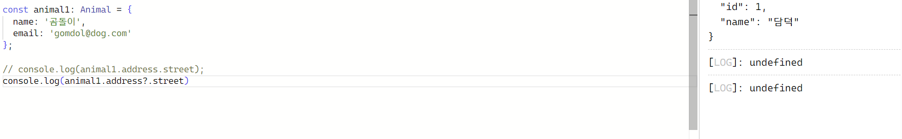

# 입실 체크 !

# 금일 수업 계획
1. 1교시 자습
2. 과제
3. TypeScript

# 과제
1. React Project를 생성 -> statetask
2. App 컴포넌트 내에 Users 컴포넌트를 배치
3. Users 컴포넌트 내에
  - const[username, setUsername]과 같은 방식으로
    username / password / email에 대한 각각의
    세 개의 상태를 선언하시오.
  - listeventform 프로젝트의 MyForm3와 동일한 기능을 하도록 나머지를 작성하시오.
    그러면 return 내부에 form 태그에 label + input이 세 개 있어야 하고,
    submit하는 input 태그가 있어야 할 것.
    각각의 onSubmit과 onChange에 대한 함수도 있어야 함.
    제출 버튼을 눌렀을 때 Hello 누구누구 라고 떠야 함.
    그리고 개발자 도구의 component 탭에 들어갔을 때 비밀번호와 이메일란에 값이 채워져야 함. 

# TypeScript 입문
- 마이크로소프트에서 개발한 JavaScript의 상위 집합 언어에 해당함.
  JavaScript에 Java나 C에서 확인할 수 있는 자료형을 명시해둔 형태라고 보면 됨.
  특히 express.js / Next.js와 같은 JS 기반 백엔드 API를 작성하게 되는 일이 늘어남에 따라
  TS의 채택이 증가하게 됨.
  이하는 TS의 장점.

1. 변수, 함수, 클래스에 자료형을 정의할 수 있음.
   이를 통해 개발 프로세스 초기에 오류를 포착하는 것이 가능함.
2. 자료형들을 한 곳에 모아놓기에 그 부분만 확인하면 된다는 장점으로,
   유지보수성이 더 높음.
3. 코드 가독성이 높고, 코드의 자체 문서화가 더 쉬움.

- 정적 타입 시스템에 익숙하지 않다면 JS보다 TS가 더 어려울 수 있으나
  저희는 Java로 시작했기에 좀 더 수월할 수 있음.

- 참고 사이트 : https://www.typescriptlang.org/play

## 공통 타입
- TS는 변수를 초기화할 때 변수의 타입을 자동으로 정의함 (JS와 동일).
  이를 _타입 추론_ 이라고 함. 이 경우 타입 추론 결과와 다른 자료형을 입력하려고 시도하면 오류가 발생함.
```ts
// 변수 선언 및 초기화
let message = 'Hello TypeScript';

// 이상의 코드에서 타입추론을 통해 자료형이 String이라고 TS가 추론함.
message = 5;        // 여기서 number 자료형으로 재대입을 시도할 때 오류가 남.
```
- TS 상에서의 기본 자료형
  1. String : 문자열
  2. number : 숫자
  3. boolean : true / false

- 추론이 아니라 자료형 자체를 명시하는 방법도 있음.
- 형식
```ts
let variable_name : type;

// 예시
let email : string;   // 그러면 알 수 있는 것은 변수의 선언만 한거고 초기화 X
let age : number;
let isActive : boolean;

email = 3;      // 그럼 이 경우에는 타입추론이 일어날만한 예시가 없음에도 오류가 남.
// 1번 라인에서 명시적으로 자료형을 적었기에..
```
그런데 이상의 경우는 email의 변수 선언과 초기화 부부이 가까우니까 그러려니 할 수 있음.
허나 저희가 Java에서 했던 것처럼 public 클래스 하나 만들어놓고,
사용하는 클래스들과 변수들 쭉 다 선언한 다음에 제어문 밑바닥에서 변수에 값을 대입하는 경우도 있음.

```ts
console.log(typeof email);

email = 'a@test.com';       // 초기화 해줌
console.log(typeof email);  // string

age = 20;
console.log(typeof age === 'string');   // false
```
- 그런데 FE 개발 도중에는 BE API에서 어떤 자료형으로 넘어오게 될지 모를 수도 있음.
  특히 외부 소스로부터 fetch를 수행했을 때 자주 일어나는 일임.
```ts
let externalValue: unknown;
```
미리 이렇게 모른다고 선언해놓고, 외부에서 값을 받은 후에 typeof 키워드를 통해 자료형을 확인하는 방식으로 써두기도 함.

- 참고 : TS에는 any라고 하는 자료형도 존재함.
        any를 작성하게 될 경우 TS는 해당 변수에 대해 타입검사 또는 타입추론을 수행하지 않음
        (즉, JS와 동일하게 굴러감.)
        이는 TS의 효과를 다 무효화하기에 가능한 any를 사용하지 않는 것을 추천

- 배열(array) : Java 생각하시면 됨.
```ts
let arrayOfNums: number[] = [1, 2, 3, 4];         // 변수 선언, 자료형 할당, 초기화
let animals: string[] = ['개', '고양이', '토끼'];
```
- 그런데 Generic도 쓸 수 있음.
```ts
let arrayOfNums: Array<number> = [5, 6, 7, 8];
let animals: Array<string> = ['dog', 'cat', 'rabbit'];
```

- 타입추론은 객체에서도 작동함. 이하와 같은 객체를 생성한다고 가정했을 때,
  TS는 각각의 key-value properties에 대해 타입추론을 실시하게 됨.
```ts
const student = {
  id : 1,
  name : '김일',
  email: 'kim1@test.com'
};
```
의 경우 
id : number,
name : string,
email : string
이라고 타입추론하게 됨.
그러면 변수에 미리 자료형을 할당하는 것과 동일하게
객체에서도 자료형을 할당하는 것이 가능함.
두 가지 방법이 있음.

```ts
// interface 키워드 이용
interface Student {
  id : number;
  name : string;
  email : string;
};

// type 키워드 이용
type Student = {
  id : number;
  name : string;
  email : string;
};
```
- 이상의 키워드 둘 다 커스텀 자료형을 만드는 방식임.
  저희는 Java에서 class 정의를 통해 많이 해옴.
  '=' 유무를 따져야 하기에 팀 프로젝트 시 type / interface 중
  하나의 키워드로 통일하시는 것을 추천함.

```ts
// 이상의 자료형을 가지고 객체를 만들어서 초기화
const myStudent: Student = {
    id: 1,
    name: '안중근',
    email: 'anJunggeun@korea.com'
};
```

- 속성 이름 끝에 물음표 (?)를 이용하는 경우 선택적 속성을 정의하는 것이 가능함.
  현재 상태에서
```ts
const yourStudent: Student = (
    id: 2,
    name: '이순신'
);
```
와 같이 속성 하나 빼먹고 객체 생성하려고 하면 객체 생성이 불가능하다는 것도 확인할 수 있음.
Java의 경우 field 빼먹으면 알아서 0이 대입되거나 null이 대입됐던 것과는 차이가 있음
```ts
type Person = {
  id: number;
  name: string;
  email?: string;
};

const person1: Person = {
  id: 1,
  name: '담덕'
};
```

- 즉 ?의 유무로 필수 속성인지 선택적인 속성인지가 나오기에 코드를 유심히 볼 필요가 있음.
- 이는 springboot에서 Entity를 정의했을 때 속성/생성자 주입을 할건지, 
  setter 주입을 할건지와도 관련이 있을 수 있음. 또한 SQL문 상에서 테이블을 정의할 때 Not Null을
  붙일지 말지와도 연결될 수 있음.

- 선택적 체이닝 연산자 (?.)를 이용하면 오류를 일으키지 않고 null이거나 undefined일 수 있는
  객체 속성 및 메서드에 안전하게 접근하는 것이 가능함.
  예시 작성하겠음.
```ts
type Animal = {
  name: string;
  email: string;
  address?: {
    street: string;
    city: string;
  }
};

const animal1: Animal = {
  name: '곰돌이',
  email: 'gomdol@dog.com'
};
```
라고 했을 때 아까 배운 ? 때문에 객체 생성이 될 것이라고 확신.


해당 경우에
```ts
console.log(animal1.address.street);
```
로 발생하면 [ERR] 이라는 오류 로그가 발생하는 반면

```ts
console.log(animal1.address?.street);
```
의 경우에는 `undefined`라고만 뜨고 오류로 인한
프로그램 종료가 일어나지 않음

- Java와는 달리 특정 type이 하나의 자료형이 아닐 수 있음.
```ts
// 타입 선언
type InputType = string | number;

// 변수들 선언
let name:InputType = 'Hello';
let age:InputType = 20;
```
- 이상과 같은 서로 다른 자료형을 처리하는 타입인 유니언 타입을 생성할 수 있음.

- 유니언 타입을 정의할 경우 기본 자료형인 string, number, boolean 뿐만 아니라
  특정 자료형을 고정시키는 것도 가능함.
```ts
type fuel = 'gasoline' | 'disel' | 'electric';
type NumOfGears = 5 | 6 | 7;

type Car = {
  brand: string;
  fuel: Fuel;
  gears: NumOfGears;
};

// Car 객체 선언
// 성공
let car1 : Car = {
    brand: '부가티',
    fuel: 'electric',
    gears: 5
};

// 실패
let car2 : Car = {
    brand: '롤스로이스',
    fuel: 'hybrid',
    gears: 6
};
```

## 함수에서의 TS
- 매개변수 타입이 정의되지 않은 경우 암시적으로 아무 타입이나 사용이 가능함.
  또한 유니언 타입을 이용하는 것도 가능함.

```ts
function checkId(id: string | number) {
  if (typeod id === 'string') {
    실행문
  }
  else {
    실행문
  }
}
```

- return 타입에서의 자료형을 명시하는 방법 // 
  Java에서는 public int checkId(String id) {}와 같은 식이어서 미리 return type을 적어둠.
```ts
function calcSum(x: number, y: number) : number {
  return x + y;
}

// 그리고 arrow function으로도 동일하게 작성할 수 있음.
const calcSum(x: number, y: number) : number => x + y;

// void인 경우에도 Java에서처럼 void라고 써주면 됨.
const sayHello(name: string) : void => console.log(`Hello ${name}`);
```

- 이상까지가 JavaScript의 부분을 일부 대체하는 TypeScript 부분이었음.

## React 에서의 TypeScript 기능 이용.
- 리액트 프로젝트가 복잡할 경우에 TS가 유용함.
  특히 특정 컴포넌트에서의 프롭과 상태에 대한 자료형 검사를
  수행하여 개발 초기에 잠재적인 오류를 감지할 수 있도록 하는 부분에서 자주 사용됨.

### state / props
### event

## TypeScript 적용 React 앱 만들기